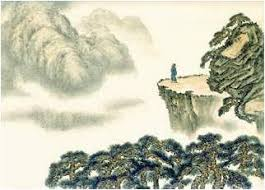

# 登幽州台歌

- Période : 唐 
- Auteur : 陈子昂

## Poème 

前不见古人，

后不见来者。

念天地之悠悠，

独怆然而涕下！

## Introduction 

Intitulé « Chant en montant à la tour de Youzhou » (登幽州台歌, Dēng Yōuzhōu Tái Gē), il a été écrit par Chen Zi'ang (陈子昂), un poète de la dynastie Tang (v. 661–702).

  
  
<em>Tour de Youzhou (幽州台), près de Pékin</em>

## Vocabulaire 

| Caractère | Pinyin | Signification | Note linguistique |
| :--- | :--- | :--- | :--- |
| **前** | *qián* | Devant / Le passé | Désigne ici les anciens souverains sages. |
| **不见** | *bù jiàn* | Ne pas voir | Structure négative classique (**不** + verbe). |
| **古人** | *gǔ rén* | Les anciens | Référence aux modèles de vertu du passé. |
| **后** | *hòu* | Derrière / Le futur | Désigne les générations à venir. |
| **来者** | *lái zhě* | Ceux qui viennent | Le suffixe **者** (*zhě*) transforme le verbe en nom (celui qui...). |
| **念** | *niàn* | Penser à / Méditer | Exprime une réflexion profonde et mélancolique. |
| **天地** | *tiān dì* | Le ciel et la terre | L'univers, le cosmos. |
| **之** | *zhī* | Particule de liaison | Marque le rapport entre l'immensité et le cosmos (similaire à "de"). |
| **悠悠** | *yōu yōu* | Infini / Éternel | Redoublement d'adjectif pour accentuer l'immensité du temps. |
| **独** | *dú* | Seul | Souligne l'isolement existentiel du poète. |
| **怆然** | *chuàng rán* | Tristement / Désolé | Le suffixe **然** (*rán*) forme un adverbe de manière. |
| **而** | *ér* | Et / Pourtant | Conjonction de coordination reliant l'état émotionnel à l'action. |
| **涕** | *tì* | Larmes | En chinois moderne, cela veut dire "mucus", mais en classique, ce sont les larmes. |
| **下** | *xià* | Tomber / Couler | Verbe de mouvement. |

## Contexte Historique

Chen Zi'ang était un poète visionnaire qui voulait réformer la poésie de son temps (qu'il jugeait trop superficielle) pour revenir au style direct et vigoureux de l'Antiquité.

Il a écrit ce poème alors qu'il servait dans l'armée lors d'une campagne contre les Khitans. Suite à des désaccords tactiques, il fut rétrogradé par son commandant. Frustré, il monta sur la tour de Youzhou (près de l'actuelle Pékin). En regardant l'horizon, il se sentit déconnecté de l'histoire : il n'avait pas de souverain sage pour le guider (comme dans le passé) et il ne verrait jamais ceux du futur.

## Signification et Analyse

Le poème se divise en deux mouvements : une vision temporelle (vers 1-2) et une vision spatiale (vers 3-4).

**L'isolement dans le Temps**
> « Devant, je ne vois pas les anciens. Derrière, je ne vois pas ceux qui viennent. »

Le poète se place sur une ligne temporelle infinie. Il se sent "entre-deux". Il admire les grands empereurs du passé qui savaient reconnaître le talent, mais ils sont morts. Il espère des successeurs, mais ils ne sont pas encore nés. Il est coincé dans un présent stérile.

**L'isolement dans l'Espace**
> « En pensant à l'immensité du ciel et de la terre... »

Il lève les yeux vers le cosmos. Face à l'éternité de la nature (Tiāndì), la vie humaine semble dérisoire et minuscule. C'est le contraste entre le temps cyclique/éternel de l'univers et le temps linéaire/court de l'homme.

**La chute émotionnelle**
> « ... Seul, accablé de tristesse, mes larmes tombent ! »

C'est le paroxysme de la solitude. Ce ne sont pas seulement des larmes de frustration politique, mais des larmes existentielles. Le poète réalise que, malgré son talent et ses ambitions, il est seul face à l'infini.